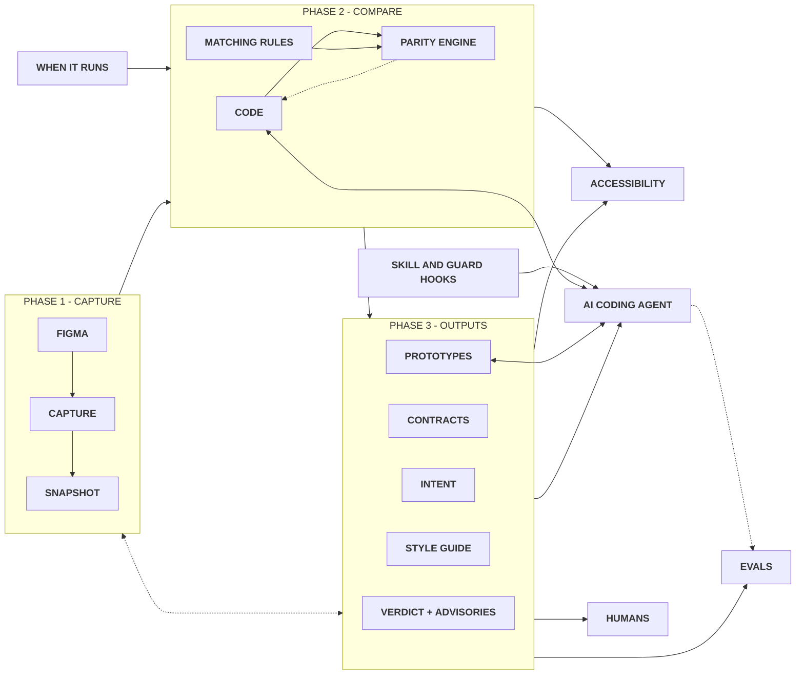

# rms-design-system-engine

**Your design system, kept true in code, for your whole team and the AI tools they use.**

It works inside Claude Code. It keeps your code matching your Figma design, and gives your team a living style guide, prototypes made of your real components and accessibility checks.

**[See a style guide it built](https://rafaelmatosdasilva.github.io/rms-ds-figma-plugins/)**

## What you get

- **High quality.** Every colour, size, font and state in your code is checked against Figma, with the fix in plain words. A product that builds a component by hand where its Figma screen uses the real one is found, and anything the check could not look at is said, never shown as passed.
- **A living style guide.** One page with every token and component, built from your system, never written by hand. Try each component, see its specs and every variant, and how it stands with Figma and accessibility at a glance.
- **Prototypes from your real system.** Describe a screen in your own words and get it made only of your components, following your guidelines and Do and Don't, with every state and screen size checked, pages you can click through, a design review before you see it, and working as your product does.
- **Accessibility tested.** Each component is tried in a real browser, and every problem comes with its fix.
- **Build from Figma.** Only have the design? Claude builds it in code, piece by piece, each piece checked.
- **You stay in control.** Nothing in your design or code changes unless you ask.

## Why not just Claude with your code?

Claude on its own guesses and cannot tell when it got something wrong. The engine gives it the exact facts from Figma and your code, then checks everything it makes.

| | Claude alone | Claude with the engine |
|---|---|---|
| Building a small design system from Figma | 8 of 18 pieces right (Opus), 4 of 18 (Haiku) | all of them, with every model |
| Prototypes from eleven requests | 17 of 33 right (Opus), 3 of 33 (Haiku) | 33 of 33 (Opus), 32 of 33 (Haiku) |
| Knows when the code stops matching Figma | no | yes, on every check, with the fix |
| Accessibility checked | only if asked, and not tried in a browser | always, tried in a browser |
| One reference for the whole team | no | the style guide, the documentation and the contracts |

The [case study](CASE-STUDY.md) tells the full story.

## How it works

A short view of the flow. The detailed flow is on the [FigJam board](https://www.figma.com/board/W5UEjkrLv5t4fqsGPQWqk8/rms-design-system-engine-flow?node-id=0-1) (Ctrl or Cmd click to open it in a new tab).



## Get started

You need [Claude Code](https://claude.com/claude-code), [Node.js](https://nodejs.org) 22 or newer and Git.

**1. Install it, once per computer.** Copy this, paste it in Claude Code and press Enter. Say yes when Claude asks to run the install, then close Claude Code and open it again.

```
Install the rms-design-system-engine skill for me by running curl -fsSL https://raw.githubusercontent.com/rafaelmatosdasilva/rms-design-system-engine/main/install.sh | bash and tell me when it is done.
```

**2. Connect your project, once per project.** It asks for your Figma link and finds the rest on its own.

```
/rms-design-system-engine set up this project
```

**3. Ask in your own words.**

```
/rms-design-system-engine check everything
/rms-design-system-engine build the style guide
/rms-design-system-engine check the modal and show it in the style guide
/rms-design-system-engine prototype a settings page with our components
/rms-design-system-engine check the accessibility of the button
```

It updates itself once a day, so you never install it again.

## Learn more

- **[Everything it does](docs/features.md)**, in plain words.
- **[Technical details](docs/details.md)**, for developers.
- **[Case study](CASE-STUDY.md)** and **[every measurement](test/skill-evals/RESULTS.md)**, how it was tested against Claude alone.

## License

[MIT](LICENSE) © Rafael Matos da Silva. Free to use, change and share. Just keep the copyright line.
