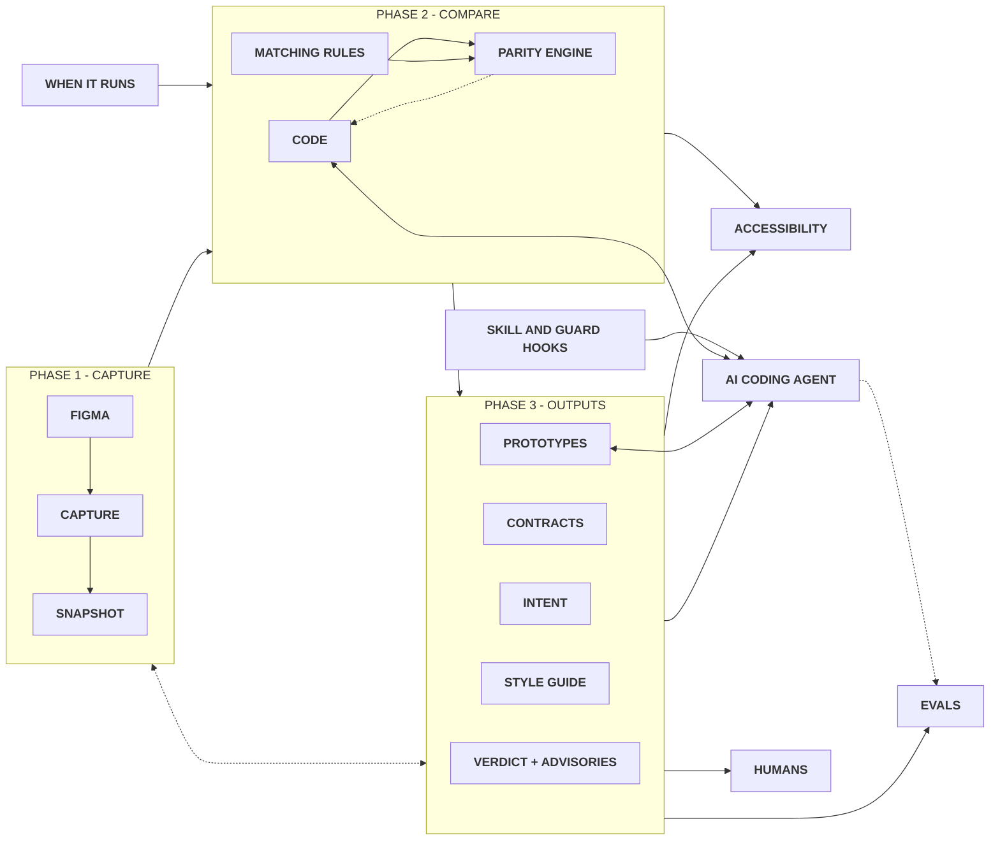

# rms-design-system-engine

**Your design system, kept true in code, for your whole team and the AI tools they use.**

It works inside Claude Code. It reads your design in Figma and your code, keeps them matching, and turns them into a living style guide, prototypes made of your real components, and accessibility checks. Designers, developers and AI all work from the same, checked design system.

**[See a style guide it built](https://rafaelmatosdasilva.github.io/rms-ds-figma-plugins/)**

## What you get

- **High quality, every time.** Every colour, size, font, spacing and component state in the code is checked against Figma. When something differs, you get what it is, where it is and how to fix it, in plain words. The checks are fixed rules, so the answer is the same every time.
- **A living style guide.** One page with every token and component, made from what Figma and the code agree on, never written by hand. Try each component, see the tokens behind it, compare it with Figma, see which products use it and what changed in each release. It looks like your system, because it is built from your system.
- **Prototypes from your real system.** Ask for a screen in your own words and get one made only of your components and tokens, in light and dark. Nothing is invented. What your system is missing is listed for your design team to decide.
- **Accessibility tested.** Text that is hard to read, controls with no name, focus you cannot see, things you cannot reach with the keyboard. Each component is held to its role, tried in a real browser, and each finding says how to fix it.
- **Build from Figma.** Have only the design? It helps Claude build your design system in code, piece by piece, checking each piece against Figma before it is called done.
- **You stay in control.** It reads Figma and never changes your design or your code unless you ask. An AI cannot accept a difference or switch a check off without asking you first.

## Why not just Claude with your code?

Claude on its own guesses. It reads a picture of your design, invents a colour or a size when it is unsure, and cannot tell when it got something wrong. The engine gives Claude the exact facts from Figma and your code first, then checks everything it makes.

| | Claude alone | Claude with the engine |
|---|---|---|
| Building a small design system from Figma | 8 of 18 pieces right (Opus), 4 of 18 (Haiku) | all of them, with every model |
| Prototypes from six requests | 13 of 18 right (Opus), 2 of 18 (Haiku) | 18 of 18 (Opus), 17 of 18 (Haiku) |
| Knows when the code stops matching Figma | no | yes, on every check, with the fix |
| Accessibility checked | only if asked, and not tried in a browser | always, tried in a browser |
| One reference for the whole team | no | the style guide, the documentation and the contracts |

The [case study](CASE-STUDY.md) tells the full story in a few pages.

## How it works

A short view of the flow. A more detailed flow can be seen on the [FigJam board](https://www.figma.com/board/W5UEjkrLv5t4fqsGPQWqk8/rms-design-system-engine-flow?node-id=0-1) (Ctrl or Cmd click to open it in a new tab).



## Get started

You need [Claude Code](https://claude.com/claude-code), [Node.js](https://nodejs.org) 22 or newer and Git.

**1. Install it, once per computer.** Copy this, paste it in Claude Code and press Enter. Claude installs it for you; say yes when it asks to run the install. Then close Claude Code and open it again.

```
Install the rms-design-system-engine skill for me by running curl -fsSL https://raw.githubusercontent.com/rafaelmatosdasilva/rms-design-system-engine/main/install.sh | bash and tell me when it is done.
```

**2. Connect your project, once per project.** It asks you only for your Figma link and finds the rest on its own. If Claude Code is open somewhere else, it also asks where your code is (a folder or a GitHub link) and remembers it.

```
/rms-design-system-engine set up this project
```

Then ask in your own words, for example

```
/rms-design-system-engine check everything
/rms-design-system-engine build the style guide
/rms-design-system-engine prototype a settings page with our components
/rms-design-system-engine check the accessibility of the button
```

It updates itself once a day, so you never install it again.

## Learn more

- **[Everything it does](docs/features.md).** How to use each part, what the style guide holds, prototypes, every check, in plain words.
- **[Technical details](docs/details.md).** For developers, every option and how each check works.
- **[Case study](CASE-STUDY.md)** and **[every measurement](test/skill-evals/RESULTS.md)**. How it was tested against Claude alone.

## License

[MIT](LICENSE) © Rafael Matos da Silva. Free to use, change and share. Just keep the copyright line.
