# rms-design-system-engine

The engine that maintains your design system.

It keeps designers, developers and the AI tools they use aligned on one design system. From your code and Figma it creates the style guide, the documentation and the contracts they all work from, then checks every change against them.

It keeps your code in parity with your design in Figma. It compares what was built (by a developer or by an AI) with what you designed: the colours, sizes, fonts, spacing, components and their states. When something is different, it tells you what, where, and how to fix it, in plain words. It also checks accessibility.

## Why use it

- **One system for everyone.** Designers, developers and AI tools work from the same style guide, documentation and contracts, made from your code and Figma, so the design system stays one system.
- **Catch differences early.** See when the code and Figma stop matching, before your users do.
- **Exact fixes, not vague notes.** Every difference comes with the file, the line and the right token to use.
- **Safer AI building.** When an AI builds screens, every change it makes is checked against your real components and tokens, and for accessibility, and it is told how to fix what does not match.
- **Accessibility included.** Text that is hard to read, buttons with no label, things you cannot reach with the keyboard.
- **The same answer every time.** The checks are fixed rules, not opinions.
- **You stay in control.** It never changes Figma, and it never changes your code unless you ask. An AI cannot accept a difference or switch a check off without asking you first.

## How it works

```mermaid
%%{init: {"flowchart": {"wrappingWidth": 420}, "themeCSS": ".nodeLabel, .nodeLabel p, .label div { text-align: left !important; }"}}%%
flowchart LR
    subgraph P1["PHASE 1 - CAPTURE"]
        FIG["<b>FIGMA</b><br/>Design system. You edit here. Source of truth."]
        CAP["<b>CAPTURE</b><br/>Captures structure, tokens, bindings, states, props, geometry, screens, icons, visual screenshots, and component sets."]
        SNAP["<b>SNAPSHOT</b><br/>JSON snapshots of tokens, components, props, geometry, icons, screens, HTML, and composition. Timestamped and versioned to detect changes and stale data."]
    end
    subgraph P2["PHASE 2 - COMPARE"]
        CODE["<b>CODE</b><br/>The DS as built in the repo, read live, not from snapshots.<br/><br/>• ds-config.json says which files: the token CSS + component CSS + markup."]
        ENG["<b>PARITY ENGINE</b><br/>Checks the code against Figma.<br/><br/>• audit.mjs with 25 gates"]
        RULES["<b>MATCHING RULES</b><br/>The few things the parity can't guess. Written once, kept in the repo.<br/><br/>• ds-config.json: your settings (files, Figma link, modes, exceptions, and the Figma-to-code naming convention)<br/>• structure-contract.mjs: which CSS class each component is<br/>• contract.authored.json: name changes between Figma and code"]
    end
    subgraph P3["PHASE 3 - OUTPUTS"]
        subgraph VERDICT[" "]
            RES["<b>PARITY OUTPUT</b><br/>The verdict: pass/fail, in the chat, in plain language.<br/><br/>• design-system-engine-history.json (records each run for the trend)"]
            ADV["<b>ADVISORIES</b><br/>Extra signals in the report. They inform, they never block.<br/><br/>• Accessibility: contrast, names, focus<br/>• AI-readiness scorecard: gate health, coverage, docs, guidance<br/>• Exemption debt: every #quot;ignore this#quot; + who owns it<br/>• Code not in Figma; contracts with no description<br/>• Drift: raw values, breaking/deprecated (+ who uses it)<br/>• Token layering<br/>Opt-in: tiers, closed vocabulary, multi-brand coverage"]
        end
        CON["<b>CONTRACTS</b><br/>The facts (the spec). Keeps AI from making things up.<br/><br/>• tokens.json contains DTCG token values<br/>• &lt;componentName&gt;.contract.json defines each component: props, slots, states, tokens, relationships (pairs-with / never-with), a usage example, and when not to use it<br/>• contract.schema.json checks they're valid<br/>• llms.txt helps AI find the right files"]
        INT["<b>INTENT</b><br/>The why. Helps AI choose the right component. Kept up to date automatically, every run.<br/><br/>• design-intent.json combines Figma annotations, component descriptions, code docs/notes, key structural facts (where each class is used), and your own external guidelines (e.g. a Notion extract)"]
        SG["<b>STYLE GUIDE</b><br/>The design system shown as one living page: every component in every state. Built automatically from the captured facts and the design intent, never hand-kept.<br/><br/>• apps/styleguide/index.html. People open it to browse; the accessibility check also renders against it."]
    end
    AI["<b>AI CODING AGENT</b><br/>Reads both the facts and the why and generates UI from the real DS, without hallucinating."]
    HUM["<b>HUMANS</b><br/>Designers and devs. They open the styleguide to browse and test the DS."]
    A11Y["<b>ACCESSIBILITY</b><br/>Accessibility (WCAG AA), in plain language: contrast, names, visible focus and focus-ring visibility, state exposure, keyboard. Flags: --axe (non-text contrast, target size, labels, landmarks), --states (hover), --json (for an agent)."]
    EV["<b>EVALS</b><br/>Checks an agent's output against the DS for hardcoded values, made-up variables, and inline styles. Runs each case N times and tracks clean runs, with an optional LLM judge.<br/><br/>• evals-history.json records each run's metrics, including zero-fix rate, violations, inline styles, and generation time, for trend tracking."]
    FIG -->|"Reads Figma. Works on any plan."| CAP --> SNAP -->|Figma facts| ENG
    CODE --> ENG
    RULES --> ENG
    ENG -.->|"optional: --fix"| CODE
    ENG -->|verdict| VERDICT
    ENG -->|writes| CON
    ENG -->|writes| INT
    ENG -.->|"writes (opt-in)"| SG
    CON -->|reads| AI
    INT --> AI
    SG ---|read| HUM
    SG -->|renders against| A11Y
    AI -.->|generated output| EV
    CON -.->|reference| EV
    INT -.->|guidance| EV
```



The same flow is on a [FigJam board](https://www.figma.com/board/W5UEjkrLv5t4fqsGPQWqk8/Figma-to-Code-Parity---Flow?node-id=0-1).

## Get started

Two steps, both inside [Claude Code](https://claude.com/claude-code). You need [Node.js](https://nodejs.org) 22 or newer and Git on your computer.

**1. Install it, once per computer.** Paste this line in Claude Code and press Enter. The `!` at the start runs it for you.

```
! curl -fsSL https://raw.githubusercontent.com/rafaelmatosdasilva/rms-design-system-engine/main/install.sh | bash
```

Then close Claude Code and open it again, so it sees the new command.

**2. Connect your project, once per project.** Open your project in Claude Code and type this. It asks you for your Figma link.

```
/rms-design-system-engine set up this project
```

That's it. **It updates itself**: once a day it checks for a newer version and updates on its own, so you never install it again.

## Use it

The easiest way is to ask in Claude Code, in your own words, after `/rms-design-system-engine`. The terminal command does the same.

| You want to | Type in Claude Code | Or in the terminal |
|---|---|---|
| Check the whole design system | `/rms-design-system-engine check everything` | `rms-design-system-engine` |
| Check one component | `/rms-design-system-engine check the button` | `rms-design-system-engine --component button` |
| Check against Figma only, without accessibility | `/rms-design-system-engine check the button against Figma, without accessibility` | `rms-design-system-engine --only parity` |
| Check accessibility only | `/rms-design-system-engine check the accessibility of the button` | `rms-design-system-engine --only accessibility` |
| Run one check (a gate) | `/rms-design-system-engine run only the token values check` | `rms-design-system-engine --only 3` |
| Ask what the design system has | `/rms-design-system-engine which props does the badge take?` | `rms-design-system-engine --query badge` |

You can mix them. `rms-design-system-engine --component button --only accessibility` checks only the accessibility of the button.

You get a short summary back: what passes, what is different, and how to fix each thing. Nothing is changed until you ask for it.

## The checks

Each check is called a gate. To run just one, use its number or its name, for example `--only 3` or `--only "token values"`.

| # | Gate | What it looks at |
|---|---|---|
| 1 | Data is up to date | You are comparing with today's Figma, not an old copy |
| 2 | Figma frame unchanged | The design still looks like the version you approved |
| 3 | Token values match Figma | Colours, sizes and fonts, in every mode (light and dark) |
| 4 | Tokens used in screens exist | Nothing a screen uses is missing from the code |
| 5 | Every mode is covered | Things that should change between light and dark really do |
| 6 | Exception lists are valid | Your "ignore this" notes still point at real things |
| 7 | No invented CSS variables | Every variable in the code comes from a Figma token |
| 8 | Docs tell the truth | Your docs mention only things that exist |
| 9 | No invented text casing | No forced UPPERCASE the design did not ask for |
| 10 | No hand-built DS components | Screens use the real component, not a hand-made copy |
| 11 | Clean CSS | Nothing unused, nothing that contradicts Figma |
| 12 | Nested components keep their styles | One component's look does not leak into another |
| 13 | Structure matches | Heights, spacing and corners |
| 14 | All states are built | Hover, disabled, selected and the rest |
| 15 | Component props match Figma | The same names, defaults and choices |
| 16 | Sub-components match Figma | The parts inside a component are the right ones |
| 17 | Templates compose the right components | Each page is built from what Figma shows |
| 18 | Markup matches | Classes, icons and every control the design shows |
| 19 | Required pieces are in place | Icon slots, component slots and form fields |
| 20 | Icons match Figma | From the shared set, drawn the same way |
| 21 | Transitions match | Durations and easing |
| 22 | Motion matches | When your design defines it |
| 23 | Shadows match | When your design defines them |
| 24 | Renders correctly in a browser | Checked on the real page, not only the code |
| 25 | What this audit actually checked | So you can see that nothing slipped through |

Accessibility is checked beside the gates. Part of it reads the code directly, and when a page can be opened it also checks it in a real browser.

## Good to know

- **Share the results with your team.** Commit the files it creates in your project, so everyone, and your automated builds, check against the same design.
- **Figma stays as it is.** It only reads Figma. It tells you what to change there, and a person makes that change.
- **More detail.** Everything for developers, every option and how each check works, is in [docs/details.md](docs/details.md).

## License

[MIT](LICENSE) © Rafael Matos da Silva. Free to use, change and share. Just keep the copyright line.
