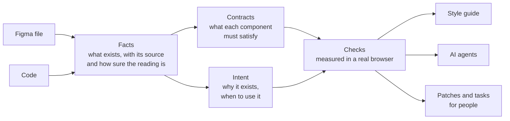

# The governance and reliability layer for AI-driven product development

<p align="center">
  <a href="https://github.com/rafaelmatosdasilva/rms-design-system-engine/actions/workflows/tests.yml"></a>
  <a href="https://github.com/rafaelmatosdasilva/rms-design-system-engine/blob/main/test/skill-evals/RESULTS.md"></a>
  <a href="https://github.com/rafaelmatosdasilva/rms-design-system-engine/blob/main/docs/details.md#security-and-data"></a>
  <a href="package.json"></a>
  <a href="https://github.com/rafaelmatosdasilva/rms-design-system-engine/blob/main/docs/details.md#code-on-gitlab"></a>
  
  <a href="LICENSE"></a>
  <a href="https://www.bestpractices.dev/projects/16082"></a>
</p>

AI agents can build interfaces in minutes. But scattered tools and specialised skills aren't enough. They work in isolation, repeat work and rarely share knowledge.

RMS Design System Engine brings everything together through one shared knowledge layer and coordinated workflows. It connects design, code and AI to understand design intent, verify implementations against explicit rules and continuously maintain alignment. Every workflow builds on what the others learn, making the whole system smarter and more reliable.

## Who it's for

- **Design-led teams** working in Figma who want to review their library, document their design system and verify accessibility.
- **Design and engineering teams** who need to maintain parity between Figma and code, verify implementations against design intent and catch inconsistencies as designs and code evolve.
- **Code-first teams** who want to improve the reliability, accessibility and maintainability of their codebase, document components, track design system health and ensure AI-generated code follows their implementation rules.

## What it does

- **Understand**: Turn real design and code sources into structured design intent, component contracts, documentation and style guides that people and AI agents can use.
- **Verify**: Run deterministic checks for design-code parity, component usage, accessibility and implementation rules, with actionable findings rather than relying on AI judgement alone.
- **Maintain**: Detect inconsistencies and regressions as tokens, components, requirements and implementations change, keeping products aligned with the design system over time.

## How it works


```mermaid
flowchart LR
  F[Figma file] --> R
  C[Code] --> R
  R["Facts<br/>what exists, with its source<br/>and how sure the reading is"] --> K["Contracts<br/>what each component<br/>must satisfy"]
  R --> I["Intent<br/>why it exists,<br/>when to use it"]
  K --> V["Checks<br/>measured in a real browser"]
  I --> V
  V --> S[Style guide]
  V --> A[AI agents]
  V --> P["Patches and tasks<br/>for people"]
```

Facts, contracts and checks are measured, never guessed by a model. AI drafts the intent layer and builds with the system, and the checks judge what it builds. When something cannot be read or run, the result says so instead of passing.

**One request, start to finish.** You ask `/rms-design-system-engine check the button`. The engine reads the button from Figma and the code, takes the components inside it along, and measures it in every state and colour mode. Each difference names its rule, the file and line, the value to write there and who fixes it. Code people wrote comes back as a patch to apply, never changed, and a change to Figma waits for a yes. The button's page in the style guide shows the same result.

**Your data stays yours.** The engine runs on your computer or your CI, with no server of its own, no npm dependencies and no usage data sent anywhere. [Security and data](https://github.com/rafaelmatosdasilva/rms-design-system-engine/blob/main/docs/details.md#security-and-data) lists every place it connects to and everything it may change.

## Get started

**Requirements:** [Claude Code](https://claude.com/claude-code), [Node.js](https://nodejs.org) 22+ and [Git](https://git-scm.com).

**Recommended:** [Google Chrome](https://google.com/chrome), so everything can be measured as a browser draws it, and TypeScript 5 (`npm i -g typescript@5`), so your components' JSX and props are read. Without them those checks are skipped; the installer tells you which are missing.

Ask Claude Code to run this command to install the engine:

```bash
curl -fsSL https://raw.githubusercontent.com/rafaelmatosdasilva/rms-design-system-engine/main/install.sh | bash
```

Restart Claude Code and run:

```text
/rms-design-system-engine set up this project
```

Once configured, ask Claude Code to check parity, audit accessibility, generate a style guide or investigate component usage.

- `/rms-design-system-engine check everything`
- `/rms-design-system-engine check the button`
- `/rms-design-system-engine check the accessibility of the button`
- `/rms-design-system-engine build the style guide`

[See every command](https://github.com/rafaelmatosdasilva/rms-design-system-engine/blob/main/docs/commands.md), grouped by type.

## Explore

- [Features and capabilities](https://github.com/rafaelmatosdasilva/rms-design-system-engine/blob/main/docs/features.md)
- [Technical documentation](https://github.com/rafaelmatosdasilva/rms-design-system-engine/blob/main/docs/details.md)
- [Commands](https://github.com/rafaelmatosdasilva/rms-design-system-engine/blob/main/docs/commands.md)
- [Security and data](https://github.com/rafaelmatosdasilva/rms-design-system-engine/blob/main/docs/details.md#security-and-data)
- [Case study](https://github.com/rafaelmatosdasilva/rms-design-system-engine/blob/main/CASE-STUDY.md)
- [Evaluation results](https://github.com/rafaelmatosdasilva/rms-design-system-engine/blob/main/test/skill-evals/RESULTS.md)
- [Live style guide](https://rafaelmatosdasilva.github.io/rms-ds-figma-plugins/)

## Open source

Built by [Rafael Matos da Silva](https://rafaelmatosdasilva.com). Released under the MIT License.
